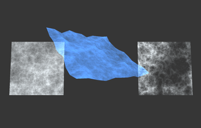

Turbulence Library by Jérémie St-Amand

--- Summary ---

Turbulence Library is a vast collection of procedural noise shaders for Unity. The noise algorithms were made by https://github.com/BrianSharpe and some of the fbms were made by http://www.decarpentier.nl/

Check out their works!

--- Getting Started ---

1. Open "Window/Noise Creator"
2. Select the desired properties
3. Press "Create Shader"
4. Select location to save shader

--- Properties ---

- Dimension:	Number of dimensions for the noise sampling.
- Noise Type:	Major noise type.
- Subtype:		Minor noise type.
- Normalized:	Normalizes the noise output. Some functions return values in the [-1, 1] range. Normalizing will output to the [0, 1] range, thus reducing the contrast between values.
- Transparent:  Makes the noise transparent depending on the noise value. A value below 0 will be completely transparent. If you want overall transparency instead, in the shader change the line "o.Alpha = h * _Transparency;" to "o.Alpha = _Transparency;".
- Animated:		Only available with 3D noises. Animates the last (3rd) dimension of the noise. Note that this effectively transforms 3D noises in 2D noises, so you would have to put the shader on a plane instead of a sphere, for example. 
- Displaced:	Displaces the vertices along their normals.
- Colored:		Allows you to color the lower and higher values of the output.
- Textured:		Allows you to apply textures to the lower and higher values of the output.

--- Misc ---

- In 2D and animated 3D noises, the texture coordinates are used to sample the noise. In non-animated 3D noises, the vertex positions are used.
- Displacement on sharp edges mat cause holes in the mesh. Always use displacement with smooth surfaces.
